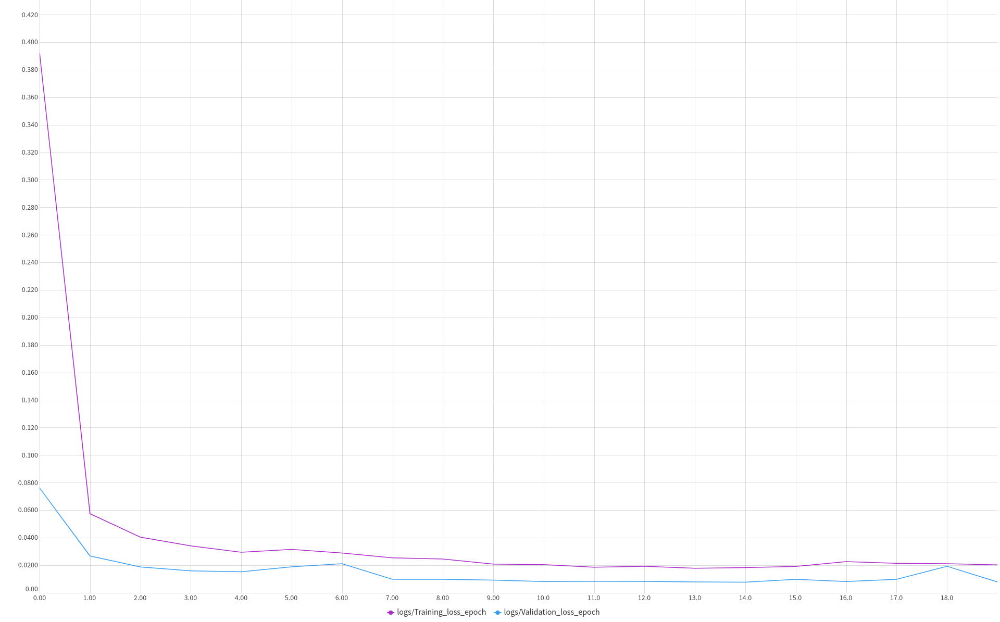
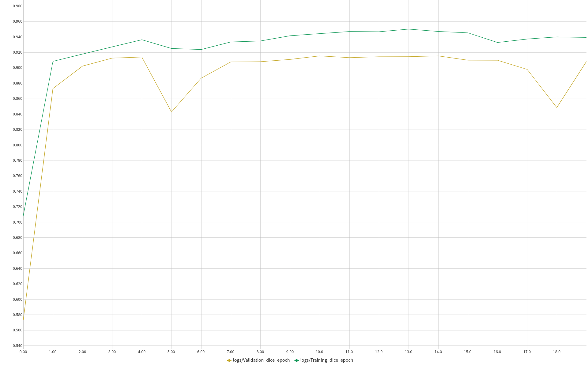

## HuBMAP - Hacking the Kidney

#### Identify glomeruli in human kidney tissue images

##### Description:

Our best estimates show there are over 7 billion people on the planet and 300 billion stars in the Milky Way galaxy. By comparison, the adult human body contains 37 *trillion* cells. To determine the function and relationship among these cells is a monumental undertaking. Many areas of human health would be impacted if we better understand cellular activity. A problem with this much data is a great match for the Kaggle community.

There are over 600,000 glomeruli in each human kidney. Normal glomeruli typically range from 100-350μm in diameter with a roughly spherical shape.

##### Dataset:

1. The dataset is comprised of very large (>500MB - 5GB) TIFF files. The training set has 8, and the public test set has 5. The private test set is larger than the public test set.
2. The mask should be binary when encoded - with `0` indicating the lack of a masked pixel, and `1` indicating a masked pixel.

##### Approach: 

1. Tiling was done as the images were of very large sizes.
2. Efficient Sampling was done:
   1. Sampling tiles via center points in the proximity of every glomerulus - this ensures that each glomerulus is seen during one epoch of training at least once.
   2. Sampling random tiles based on region probabilities.
   3. All this was possible with the help of [deepflash2](https://matjesg.github.io/deepflash2/).
3. Model - UNet architecture with efficientnet b4 backbone.
4. Optimizer - AdamW with weight decay = 0.01
5. Loss - Cross Entropy with Dice Loss.
6. Schedular - Cosine Annealing warm restarts with T_0 = 5 and T_mult = 2.
7. Metric - Dice Coefficient

##### Training Results:

Loss:

Metric:

Public Leaderboard Score - 0.923

##### Resources:

1. https://www.kaggle.com/matjes/hubmap-efficient-sampling-deepflash2-sub
2. https://www.kaggle.com/matjes/hubmap-efficient-sampling-deepflash2-train
3. https://www.kaggle.com/matjes/hubmap-zarr
4. https://www.kaggle.com/yassinealouini/all-the-segmentation-metrics
5. https://www.kaggle.com/bigironsphere/loss-function-library-keras-pytorch
6. https://arxiv.org/pdf/2006.14822.pdf
